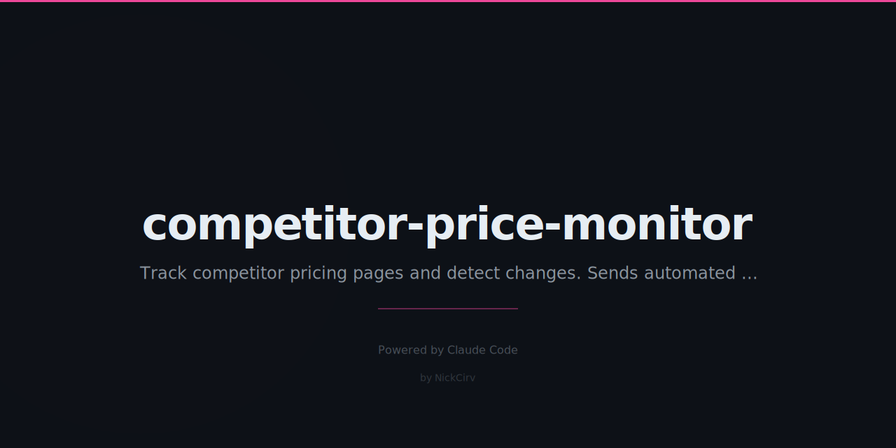

# Competitor Price Monitor - MCP Automated PRD

**Created:** 2026-01-23
**Category:** MCP-AUTOMATED / Intelligence Products
**Status:** 🔴 NEW - High Priority
**Priority:** HIGH - Build This Week

---

## Quick Reference

**What It Is:** Automated price tracking across competitors with instant alerts when prices change

**Revenue:** $800-2,500/month (8-25 customers at $99/mo)

**Build Time:** 4 hours (one-time)

**Automation Level:** 100% automated after setup

**MCP Tools:** `Apify Amazon/Shopify Scrapers` + diff detection + Slack/Email alerts

---

## How It Works

```
┌─────────────────────────────────────────────────────────────────┐
│ CONTINUOUS PRICE MONITORING PIPELINE                             │
├─────────────────────────────────────────────────────────────────┤
│                                                                  │
│ 1. SETUP: Customer provides competitor product URLs              │
│    → Amazon ASINs                                                │
│    → Shopify product pages                                       │
│    → Any e-commerce URL                                          │
│                                                                  │
│ 2. SCHEDULE: Check every 4/12/24 hours (tier dependent)          │
│                                                                  │
│ 3. SCRAPE: Apify actors extract current prices                   │
│    → Product title                                               │
│    → Current price                                               │
│    → Sale/discount status                                        │
│    → Stock availability                                          │
│    → Rating changes                                              │
│                                                                  │
│ 4. COMPARE: Against last known price                             │
│    → Price increase/decrease detection                           │
│    → Sale started/ended                                          │
│    → Out of stock alerts                                         │
│    → Historical price tracking                                   │
│                                                                  │
│ 5. ALERT: Instant notification                                   │
│    → Slack webhook                                               │
│    → Email                                                       │
│    → Daily digest option                                         │
│                                                                  │
│ 6. INSIGHT: Weekly summary report                                │
│    → Average competitor prices                                   │
│    → Your price position (highest/lowest/middle)                 │
│    → Recommended pricing adjustments                             │
│                                                                  │
└─────────────────────────────────────────────────────────────────┘
```

---

## Implementation Plan

### Phase 1: Multi-Platform Scrapers (2 hours)

**Amazon:**
```javascript
// Apify Actor: apify/amazon-scraper
{
  "asins": ["B0XXXXXX", "B0YYYYYY"],
  "country": "US"
}
// Returns: title, price, rating, reviews, availability
```

**Shopify:**
```javascript
// Apify Actor: jupri/shopify-scraper
{
  "startUrls": ["https://store.com/products/item"]
}
// Returns: title, price, variants, images
```

**Generic (any site):**
```javascript
// Apify Actor: apify/web-scraper
// Custom selectors for price extraction
```

### Phase 2: Price Change Detection (1 hour)

```python
def detect_price_changes(current, previous):
    alerts = []
    for product_id, data in current.items():
        old_price = previous.get(product_id, {}).get('price')
        new_price = data['price']

        if old_price and new_price != old_price:
            change_pct = ((new_price - old_price) / old_price) * 100
            alerts.append({
                "product": data['title'],
                "old_price": old_price,
                "new_price": new_price,
                "change": f"{change_pct:+.1f}%",
                "url": data['url']
            })
    return alerts
```

### Phase 3: Alert System (1 hour)

**Slack Alert:**
```json
{
  "text": "🚨 Price Change Alert",
  "blocks": [
    {
      "type": "section",
      "text": "Competitor X dropped price on Product Y from $99 to $79 (-20%)"
    }
  ]
}
```

**Email Digest:**
- Daily summary of all changes
- Weekly trend report
- Pricing recommendation engine

---

## Pricing

| Tier | Price | Products | Check Frequency | Target |
|------|-------|----------|-----------------|--------|
| **Starter** | $49/mo | 25 products | Every 24h | Small shops |
| **Pro** | $99/mo | 100 products | Every 12h | Growing brands |
| **Business** | $199/mo | 500 products | Every 4h | E-commerce |
| **Enterprise** | $499/mo | 2000+ products | Every hour | Large retailers |

---

## Target Market

**Primary Customers:**
- E-commerce store owners
- Amazon FBA sellers
- Dropshippers
- Retail pricing managers
- Brand managers

**Pain Points:**
- Competitors change prices without notice
- Manual price checking is time-consuming
- Miss opportunities to match/beat prices
- Can't track multiple competitors efficiently
- Enterprise price intelligence tools cost $500+/mo

**Value Proposition:**
"Know the moment your competitors change prices. React instantly, never lose a sale."

---

## Use Cases

### 1. Amazon Seller
- Track 50 competing products
- Alert when competitor goes out of stock (opportunity!)
- Alert when competitor drops price (match or beat)
- Alert when competitor raises price (room to increase)

### 2. Shopify Store Owner
- Monitor 20 competitor stores
- Track pricing across product categories
- Seasonal sale detection
- New product launches from competitors

### 3. Supplement Business (Cirv!)
- Track Lion's Mane prices across Amazon, iHerb
- Monitor competitor promotions
- Identify pricing sweet spots
- Stock availability intelligence

---

## Technical Architecture

```
┌─────────────┐
│  Customer   │
│  Dashboard  │
└──────┬──────┘
       │ (add products to track)
       ▼
┌─────────────┐     ┌─────────────┐     ┌─────────────┐
│   Cron/n8n  │────▶│   Apify     │────▶│  Database   │
│  (4/12/24h) │     │  Scrapers   │     │  (History)  │
└─────────────┘     └─────────────┘     └──────┬──────┘
                                               │
       ┌───────────────────────────────────────┤
       ▼                                       ▼
┌─────────────┐                         ┌─────────────┐
│    Slack    │                         │   Email     │
│   Webhook   │                         │   Digest    │
└─────────────┘                         └─────────────┘
```

**Costs per customer:**
- 100 products × 2 checks/day × 30 days = 6000 requests
- Apify cost: ~$10-15/mo per customer
- Margin: $99 - $15 = $84 profit

---

## Competitive Analysis

| Feature | Us | Prisync | Competera |
|---------|-----|---------|-----------|
| Price (100 products) | $99/mo | $189/mo | $500+/mo |
| Real-time alerts | ✓ | ✓ | ✓ |
| Slack integration | ✓ | Add-on | ✓ |
| Amazon support | ✓ | ✓ | ✓ |
| Any website | ✓ | Limited | Enterprise |
| Setup time | 10 min | 1 hour | Days |

---

## Marketing

**Launch Strategy:**

1. **Shopify Facebook Groups** - "Built a price monitoring tool for $99/mo. Enterprise features without enterprise pricing."

2. **Amazon Seller Forums** - "Track competitor prices and get Slack alerts. First 20 sellers get 50% off forever."

3. **E-commerce Twitter** - Share anonymized insights: "Analyzed 500 supplement products. Average price change frequency: 2.3x/month."

**First 10 Customers:**
- Free 14-day trial with full features
- Personal onboarding call
- Lifetime 50% discount for testimonial

---

## Success Metrics

| Metric | Target |
|--------|--------|
| Price accuracy | 99%+ |
| Alert latency | <15 min from change |
| False positive rate | <1% |
| Customer churn | <3% monthly |
| Avg products tracked | 75+ per customer |

---

## Cirv Supplement Integration

**Use This For Your Own Business:**
- Track 30 competing mushroom supplements on Amazon
- Monitor iHerb competitor prices
- Detect when competitors run sales
- Identify optimal pricing for UAE market
- Stock level intelligence (buy opportunity when competitors out)

---

## Next Steps

1. [ ] Test Apify Amazon Scraper with 5 products
2. [ ] Test Shopify Scraper with 5 stores
3. [ ] Build price comparison logic
4. [ ] Set up Slack webhook
5. [ ] Create email alert template
6. [ ] Build simple product URL input form
7. [ ] Test full pipeline for 1 week
8. [ ] Launch to Shopify Facebook groups

---

**Status:** 🔴 NEW → 🟡 Building → ✅ Launched → 💰 Profitable

**Last Updated:** 2026-01-23
